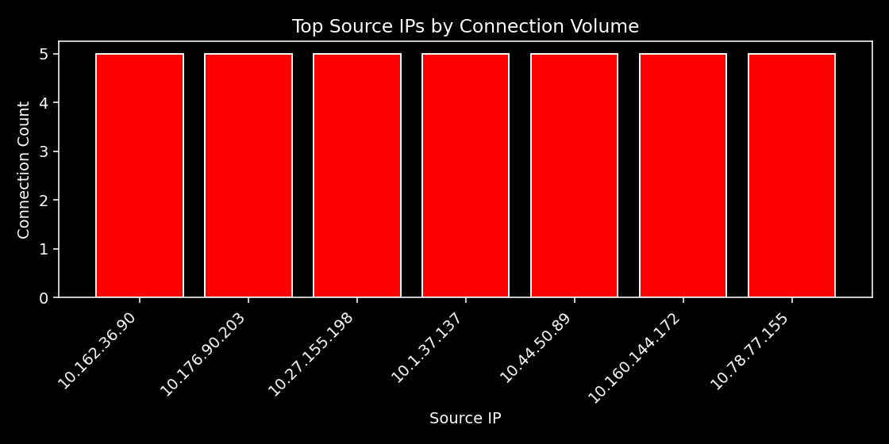

# Network-Threat-Intelligence-Analysis

📊 Automated defensive network analysis with OSINT enrichment and threat correlation

---

📡 Defensive network intelligence research and automation for security operations and analytic environments.

---

## 🗂 Overview

This repository demonstrates a Blue Team–focused approach to analyzing network activity,  
open-source threat intelligence, and vulnerability data in support of defensive cyber operations.  
The emphasis is on **analytical reasoning, correlation of intelligence, and repeatable workflows**,  
reflecting how network-centric threat intelligence informs operational decision-making.

---

## 🔍 Analytical Focus

Designed to support:

- Understanding network behavior and traffic patterns  
- Applying OSINT to contextualize observed activity  
- Correlating indicators of compromise with network-derived insights  
- Prioritizing risk to support informed defensive actions  

The goal is **clarity, attribution context, and defensibility**, not detection for its own sake.

---

## 📈 Operational Outcomes

Execution produces:

- Analyst-ready intelligence artifacts  
- Correlated threat indicators to guide mitigation  
- High-level visualizations summarizing network activity trends  
- Written summaries aligned with reporting and briefing standards  

Outputs provide **actionable insight for analysts and decision-makers**.

---

## ⚙️ Automation & Design

Workflows are automated for consistency while keeping final conclusions **analyst-driven**.  
Processes mirror operational environments requiring **traceability, documentation, and discipline**.

---

## 🛡️ Intended Use

For:

- Defensive cybersecurity professionals  
- Threat intelligence analysts  
- Security operations teams in government, federal, or mission-driven organizations  

Demonstrates workflows and outputs that **enable informed decision-making, operational awareness, and risk-based defense**.

---

## 📊 Daily Analysis Snapshot

> This section is dynamically updated by automated workflows.

### **Daily Automated Threat Intelligence Update**

- **Last Pipeline Update:** {{TIMESTAMP}}
- **Vulnerabilities loaded:** {{VULN_COUNT}}
- **OSINT IOCs loaded:** {{IOC_COUNT}}
- **Top Source IPs analyzed:** {{TOP_IP_COUNT}}
- **High-Risk Vulnerabilities (score >7):** {{HIGH_RISK_COUNT}}

<!--TOP_IPS_TABLE-->

*This summary is auto-generated by the workflow.*

---

### **Generated Files and Outputs**

#### **Reports**
- [Matched IOCs CSV](outputs/reports/matched_iocs.csv)  
- [High-Risk Vulnerabilities CSV](outputs/reports/high_risk_vulns.csv)  
- [Analysis Summary MD](outputs/reports/analysis_summary.md)

#### **Charts**

#### **Logs**
- [Top Source IPs CSV](outputs/logs/top_source_ips.csv)

---

## ⚠️ Legal & Ethical Notice

This project is strictly defensive:

- No exploitation, intrusion, or active scanning  
- Data is sanitized, simulated, or derived from public sources  
- Usage limited to education, research, and lawful defensive analysis

---

## 🚨 Status

This repository is actively maintained and updated as part of an ongoing **network threat intelligence workflow**.  
Analysis artifacts, correlated indicators, and visual summaries are refreshed on a regular basis to reflect the latest defensive insights.  
Demonstrates **repeatable, analyst-driven processes** consistent with operational security and intelligence standards.
