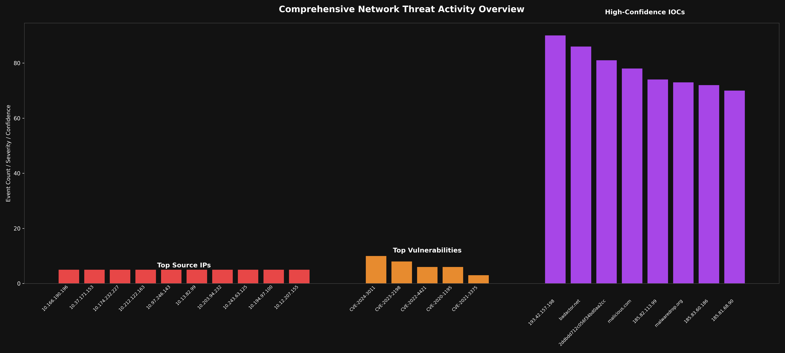
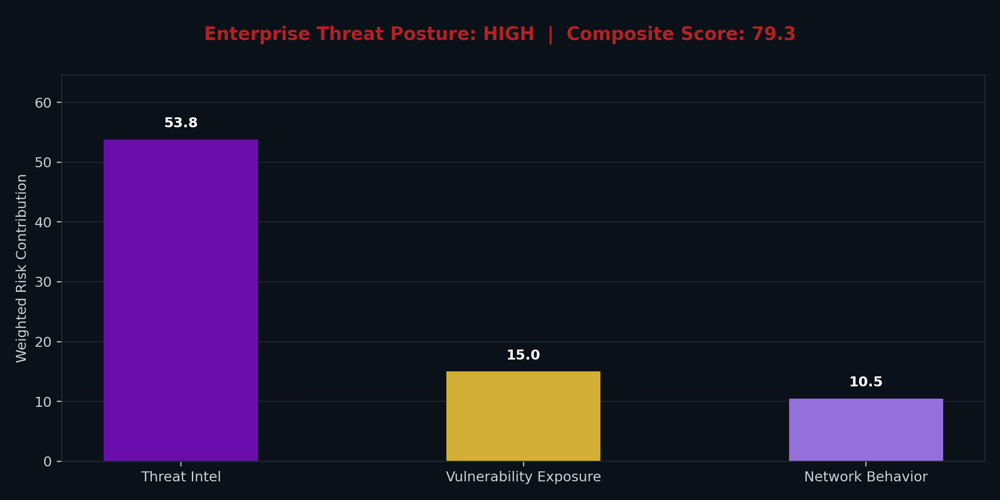
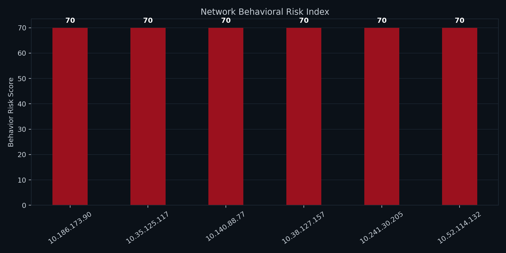
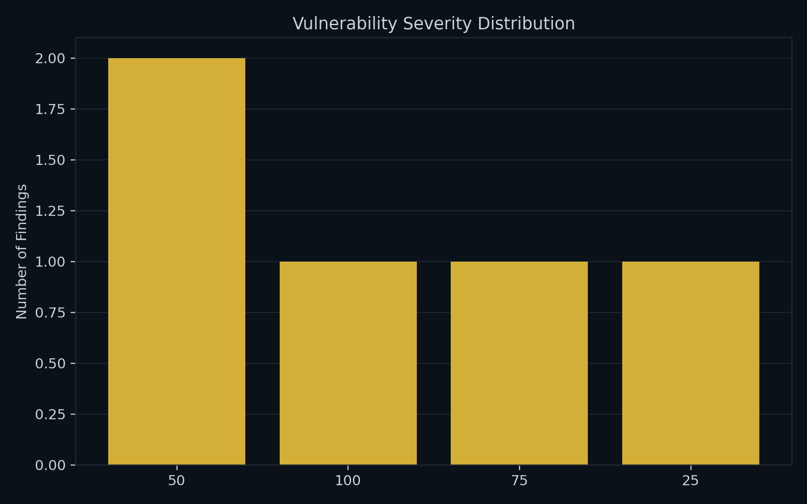

# Network Threat Intelligence Analysis

⚠️ **Automated Network Threat Intelligence, OSINT Correlation, and Risk Prioritization** ⚠️

This repository implements an **automated defensive threat-intelligence pipeline** designed to simulate how a SOC ingests, enriches, correlates, and prioritizes security data from multiple sources.

It focuses on **actionable intelligence**, not raw data.

---

## 🎯 Project Purpose & Scope

The primary objective of this project is to:

- Correlate **network activity**, **OSINT threat indicators**, and **vulnerability data**
- Identify **high-risk assets and behaviors**
- Produce **repeatable, automated intelligence reports**
- Demonstrate real-world **SOC and Blue Team workflows**

This is **not** a scanner or IDS replacement.  
It is an **intelligence aggregation and prioritization layer**.

---

## 🔄 Automation & Update Frequency

⏱️ **Update Frequency:**  
- Runs automatically via **GitHub Actions**
- Executes **multiple times per day** (scheduled and trigger-based)

Each execution:
- Regenerates intelligence datasets
- Recalculates risk prioritization
- Updates charts and summaries
- Rewrites the README snapshot section automatically

All timestamps are recorded in **UTC**.

---

## 📡 Intelligence Sources & Analysis Layers

### 🛰️ Open-Source Threat Intelligence (OSINT)
- Simulated high-confidence Indicators of Compromise (IOCs)
- Includes IPs, domains, URLs, and file hashes
- Ranked by **confidence score**
- Models curated threat feeds (CERTs, ISACs, vendor intelligence)

### 🔥 Vulnerability Risk Analysis
- Simulated vulnerability scan results
- CVEs prioritized using a calculated **risk score**
- Reflects exploitability and operational impact
- Mirrors remediation-driven SOC workflows

### 🌐 Network Traffic Analysis
- PCAP-derived network activity analysis
- Identifies **top source IPs by connection volume**
- Highlights anomalous or suspicious traffic patterns
- Visualized for rapid analyst triage

---

## 📊 Network Activity Visualization

🚨 **Top Source IPs by Connection Volume**

This chart highlights the most active source IPs observed in the analyzed traffic.  
Elevated activity may indicate:
- Reconnaissance or scanning behavior
- Misconfigured systems
- Potential malicious activity

---

<!-- AUTO-GENERATED-START -->

# Enterprise Security Intelligence Dashboard
**Last Updated (UTC):** 2026-02-27 04:44

---

## Threat Intelligence Overview
| ioc_value                | ioc_type   |   confidence |
|:-------------------------|:-----------|-------------:|
| 185.83.60.186            | hash       |           92 |
| badactor.net             | domain     |           91 |
| 2ddbdd712c056f34bd0aa2cc | ip         |           87 |
| 193.42.157.198           | domain     |           87 |
| 185.81.68.90             | ip         |           86 |
| malicious.com            | ip         |           84 |
| 185.82.113.99            | domain     |           77 |
| malwaredrop.org          | domain     |           71 |

---

## Vulnerability Exposure Analysis
| vulnerability   | severity   |   severity_score |   risk_score |
|:----------------|:-----------|-----------------:|-------------:|
| CVE-2024-3011   | Critical   |                9 |          100 |
| CVE-2023-2198   | High       |                7 |           75 |
| CVE-2022-4421   | Medium     |                5 |           50 |
| CVE-2021-3375   | Low        |                3 |           25 |
| CVE-2020-1195   | Medium     |                5 |           50 |

---

## Enterprise Threat Posture

---

## Network Behavioral Risk Index

---

## Vulnerability Severity Distribution

<!-- AUTO-GENERATED-END -->

